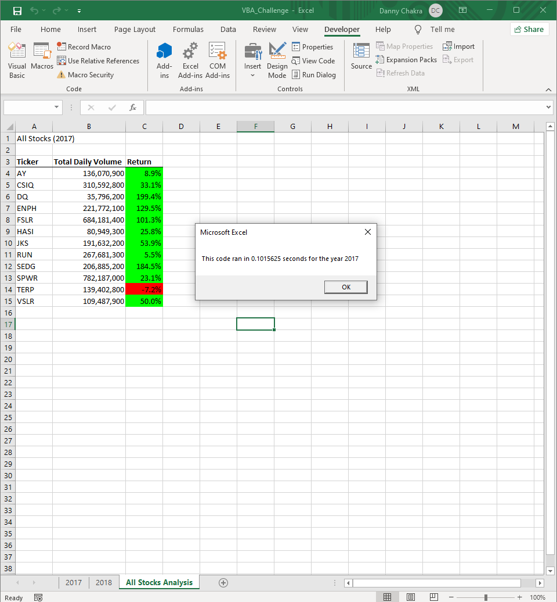
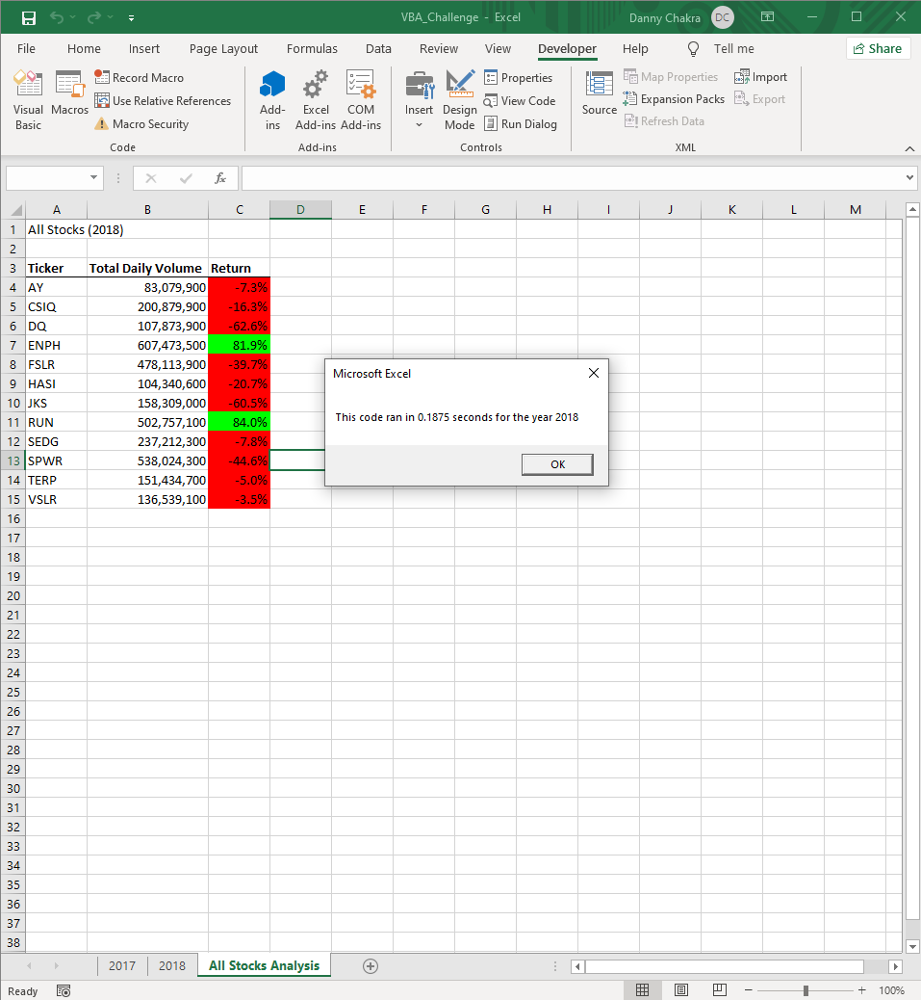
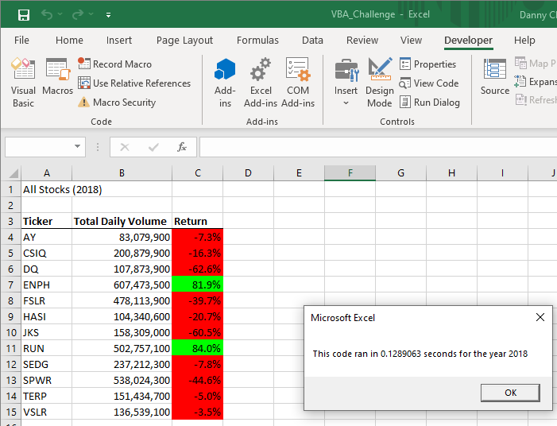

# Stock Analysis Workbook Refactoring

## Overview of Project

### Refactoring the stock analysis workbook code to ensure it will run smoothly with larger data sets.

## Results

After refactoring the code of the original Stock Analysis Workbook, I was able to reduce looping redundancies and reduce the program’s run time. Below is a picture of the captured run time of program before and after the refactoring for the Stock Analysis of 2017.

, 

As you can see, the refactoring has done its job of reducing the program’s run time while having no impact on the output. You will notice a similar decrease in run time when using the refactored program to analyze the data from 2018 as well. 

, 

The decrease in the run time is only marginal in the analysis of 12 stocks. But the refactored program is able to perform the same analysis on much larger data sets with any number of stocks, unlike the original version which would require additional code to be entered manually for every new stock ticker in the data set.

## Summary

1.	The most obvious advantage of refactoring is that it leads to better quality code. It may help the program run faster, but more importantly it improves the design and makes the software easier to understand. Refactoring will also make the program easier to debug. And by storing all arbitrary numbers into variables it becomes much easier to edit the code due to changes in the data set format. The disadvantages to refactoring code is that it is time spent on a program that is already functional, and you may unintentionally cause bugs while refactoring which turns your previously working program into one that doesn’t work.
2.	In the case of our Stock Analysis program, the biggest advantage is that we can increase the data set to include additional stocks and the program can produce the analyzed output with no changes required to the code. Also, if the code required editing due to changes to the data set’s format, such as the stock’s ticker, daily volume, or closing price being moved to different locations, then we would save on time since the number of changes required on the refactored code are much less than on the original code. The only disadvantage to refactoring this program was the time spent on editing the code, but that was a small price to pay considering the improvements.
